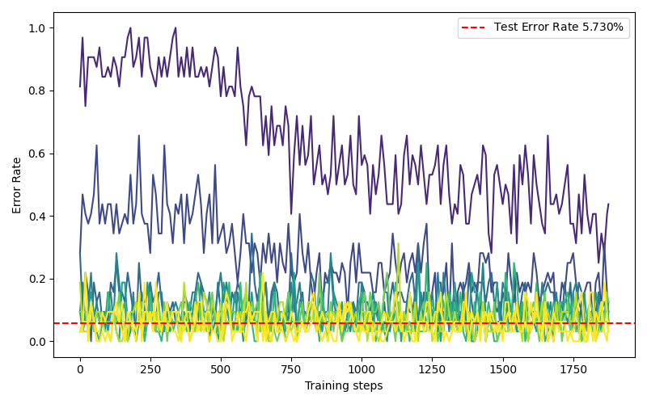

# Forward forward

Implementation of the forward-forward algorithm proposed in the paper [1](https://doi.org/10.48550/arXiv.2212.13345) by Geoffrey Hinton, with a few modifications.

## Result

Trained on the MNIST dataset for 90 epochs, the model achieves ~90% accuracy on the test set.

